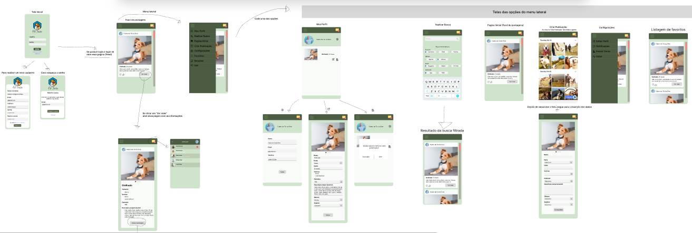

# Projeto Extensionista da Disciplina de Computação Móvel

## Pet Finder
Pet Finder é um aplicativo Android que será desenvolvido por estudantes do 5º Semestre do Curso de Sistemas de Informação, da Universidade Franciscana (UFN). Tem o objetivo de auxiliar a comunidade na doação de animais.

Os protótipos de tela foram desenvolvidos no Figma:  
[Link do Figma](https://www.figma.com/file/4UYmxjJ30Wu5QA8CacLTsG/Untitled?type=design&node-id=0%3A1&t=zqqFHQqMbJukmqUj-1)

### Desenvolvedores:
- Douglas Kenji Kihara
- Gabriel Castagna Henrique
- Carlos Marcelo M. Filho
- Leonardo Pereira
- Matheus Freitas
- Júnior Ferreira
- Lucas Schaefer

### Professor Avaliador:
- Guilherme Chagas Kurtz
